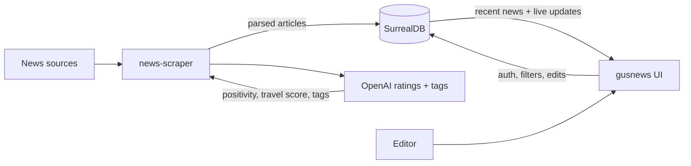

# gusnews

[](https://github.com/mirsella/gusnews/actions/workflows/nuxt.yml)
[](https://nuxt.com)
[](https://vuejs.org)
[](https://pnpm.io)
[](https://surrealdb.com)
[](LICENSE)

A Nuxt frontend for browsing, filtering, editing, and curating the news dataset collected by [`news-scraper`](https://github.com/mirsella/news-scraper). It connects directly to SurrealDB, loads recent articles, subscribes to live updates, and gives editors a fast table/card workflow for ratings, tags, notes, links, and used-state tracking.

`gusnews` is the UI half of the system. The scraper pipeline collects and rates articles; this app makes that database searchable and usable.

## Pipeline



## Features

- Client-only Nuxt app (`ssr: false`) built around Nuxt UI components.
- SurrealDB endpoint racing: connects to the fastest configured database URL.
- JWT-based SurrealDB scope authentication with local storage persistence.
- Live `news` table subscriptions for create, update, and delete changes.
- Filterable, sortable news table with pagination and persisted column/page-size preferences.
- Article detail modal with editable ratings, travel ratings, notes, tags, and used-state.
- Feed route support through `/:feed` for region/tag-specific views.
- Docker build target with configurable `BASE_URL` for subpath deployment.

## Requirements

- Node.js 20 or newer.
- pnpm.
- A compatible SurrealDB instance using the schema from [`news-scraper`](https://github.com/mirsella/news-scraper).

CI builds the app on Node.js 20 with `pnpm build`.

## Quick Start

```bash
git clone git@github.com:mirsella/gusnews.git
cd gusnews
pnpm install
pnpm dev
```

The development server starts with Nuxt's default dev URL. In development, the app also tries `http://localhost:8000` as a SurrealDB endpoint.

## Configuration

SurrealDB endpoints are configured in [`nuxt.config.ts`](nuxt.config.ts):

```ts
runtimeConfig: {
  public: {
    surrealdb_urls: [
      "https://db.lemediapositif.com",
      "http://db.lemediapositif.com",
      "http://vps.mirsella.mooo.com:8000",
      "http://intra.lemediapositif.com:8000",
    ],
  },
}
```

The app connects to namespace `news`, database `news`, and authenticates against the `user` scope defined by the scraper database schema.

## Scripts

| Command | Description |
| --- | --- |
| `pnpm dev` | Start the Nuxt development server. |
| `pnpm build` | Build the production app. |
| `pnpm generate` | Generate a static output when compatible with deployment needs. |
| `pnpm preview` | Preview the production build locally. |

## Docker

Build and run the container with the included makefile:

```bash
make build
make run
```

By default, the image is built for the `/gusnews` base path. Override it when deploying elsewhere:

```bash
make build BASE_URL=/
```

The container exposes port `3000` and runs Nuxt from `.output/server/index.mjs`.

## Companion Service

[`news-scraper`](https://github.com/mirsella/news-scraper) is the backend pipeline that fetches articles, parses content, stores normalized records in SurrealDB, and uses OpenAI to generate ratings and tags. Run it first when you need a local or fresh dataset for `gusnews`.

## License

This project is licensed under the [MIT License](LICENSE).
